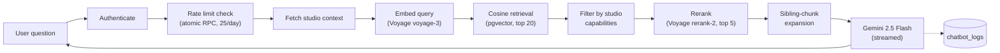
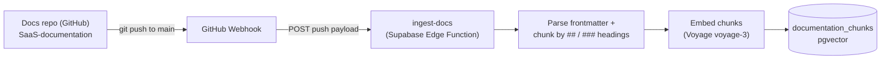

# SaaS Documentation Chatbot (RAG)

A Retrieval-Augmented Generation chatbot that answers studio owners' and staff's questions using SaaS's own documentation — nothing else. It runs as two Supabase Edge Functions: one that answers questions in real time, and one that keeps the underlying knowledge base in sync with the documentation source automatically.

---

## System Overview

| Function | Role |
|---|---|
| `ai-chatbot-docs` | Handles a chat request end-to-end: auth, rate limiting, retrieval, reranking, and a streamed answer from Gemini 2.5 Flash |
| `ingest-docs` | Keeps the vector store in sync with the documentation repo — triggered automatically by a GitHub webhook on every push, or manually via a full resync |

Both are Deno-based Supabase Edge Functions and share the same `documentation_chunks` table (Postgres + `pgvector`) as their knowledge base.

---

## 1. Chat Pipeline (`ai-chatbot-docs`)

**Step by step:**

1. **Authenticate** — the caller's Supabase JWT is verified and resolved to a user id.
2. **Rate limit** — an atomic Postgres RPC (`check_chatbot_limit`) checks and increments the user's daily message count (25/day, resets at midnight Beirut time). If the RPC itself fails, the request is **failed open** — allowed through rather than blocking every user because of an infra issue.
3. **Studio context** — the user's studio settings (`has_classes`, `has_appointments`, role) are looked up so the assistant knows which product features are actually relevant to them.
4. **Search query construction** — the last 2 turns of chat history are appended to the current question before embedding, so follow-up questions retrieve correctly even without repeating context.
5. **Embed + retrieve** — the query is embedded with Voyage AI's `voyage-3` model, then matched against `documentation_chunks` via a cosine-similarity RPC (`match_chunks`), over-fetching the top 20 candidates.
6. **Studio-aware filtering** — chunks tagged `classes` or `appointments` in their metadata are dropped if the studio doesn't have that feature enabled, so the bot never recommends something the studio can't use.
7. **Rerank** — the filtered candidates are reranked with Voyage's `rerank-2` model down to the final top 5. If reranking fails, it falls back to cosine order rather than failing the request.
8. **Sibling-chunk expansion** — for any matched chunk that belongs to a subsection (heading contains `>`), every other chunk under the same parent heading is pulled in too, so the model sees the full section rather than an isolated fragment. (Defensive: the current documentation set has no nested headings yet, so this is a no-op today but is ready for larger procedural docs.)
9. **Generate** — the final context is passed to **Gemini 2.5 Flash** (`temperature: 0.1`, capped at 2048 output tokens) under a strict system prompt: answer only from the provided docs, say so explicitly when the docs don't cover something, ask at most one clarifying question if the query is too vague, and format instructions as numbered steps with bolded UI elements. The response is streamed back to the client via SSE.
10. **Logging** — once the stream completes, the question and full answer are written to `chatbot_logs` (fire-and-forget, doesn't block the response).

Chat history is capped at the last 10 turns, kept verbatim (no summarization yet).

---

## 2. Documentation Ingestion & Auto-Sync (`ingest-docs`)

This is the part that keeps the chatbot's knowledge current without any manual re-indexing.

**How docs go from Markdown to searchable chunks:**

1. **Frontmatter parsing** — each Markdown file's YAML frontmatter is parsed out and kept as chunk metadata (used later for studio-aware filtering).
2. **Chunking** — the body is split by `##` headings. Each section becomes a chunk prefixed with the doc's H1 title and its own heading, capped at ~10,000 characters (~800 tokens). Oversized sections are split further by `###` subheadings, with the heading recorded as `Parent > Child` — this is what the sibling-expansion step in the chat pipeline looks for later.
3. **Embedding** — every chunk is embedded with Voyage AI's `voyage-3` model.
4. **Storage** — old chunks for that file are deleted and the freshly chunked/embedded versions are inserted into `documentation_chunks`, so renamed or removed headings don't leave stale rows behind.

**Two ways this runs:**

- **Automatic, via GitHub Webhook** — a webhook is configured on the `SaaS-documentation` repo (GitHub Settings → Webhooks, not GitHub Actions — a webhook is a simple HTTP callback GitHub fires on repo events, separate from the Actions/CI system) that sends a `POST` to the `ingest-docs` function on every push to `main`. The function reads the push payload, and for every added/modified `.md` file it re-chunks and re-embeds it; for every removed file, it deletes the corresponding chunks. This means editing a doc and pushing to `main` is enough — the vector store updates itself within seconds, with no manual re-indexing step.
- **Manual, via full resync** — calling the function with `{ full_resync: true }` walks the entire repo tree, re-chunks and re-embeds every `.md` file, and prunes chunks for any file that no longer exists in the repo. Used for bulk re-indexing (e.g. after a chunking-logic change) rather than day-to-day updates.

---

## Tech Stack

| Layer | Technology |
|---|---|
| Embeddings | Voyage AI (`voyage-3`) |
| Reranking | Voyage AI (`rerank-2`) |
| Vector store | `pgvector` on Postgres (Supabase) |
| LLM / generation | Google Gemini 2.5 Flash (streamed via SSE) |
| Runtime | Supabase Edge Functions (Deno) |
| Auth | Supabase JWT |
| Docs source | Markdown files (with YAML frontmatter) in a GitHub repo |
| Auto-sync | GitHub Webhook → `ingest-docs` on every push to `main` |
